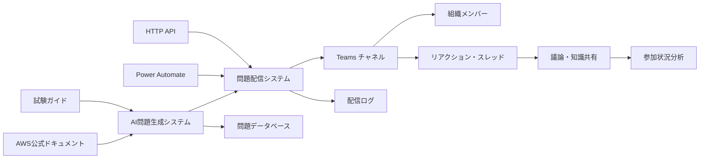
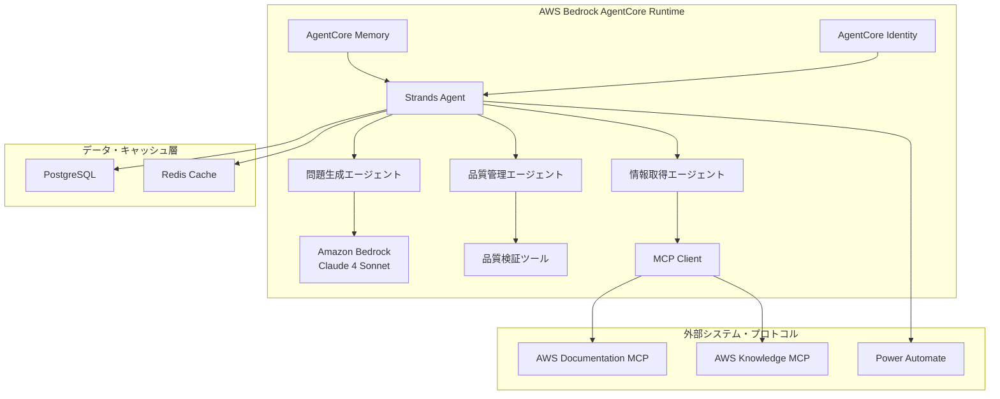
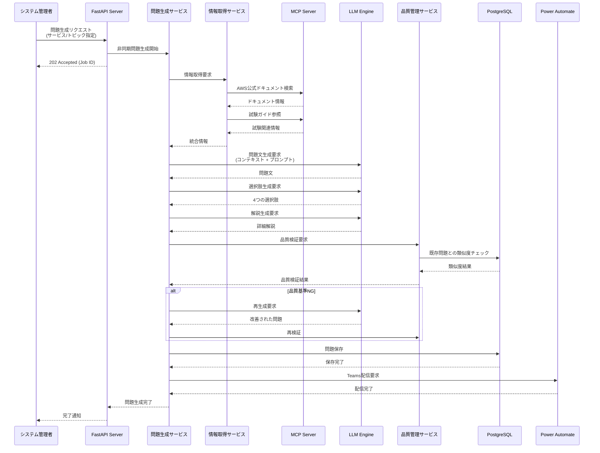
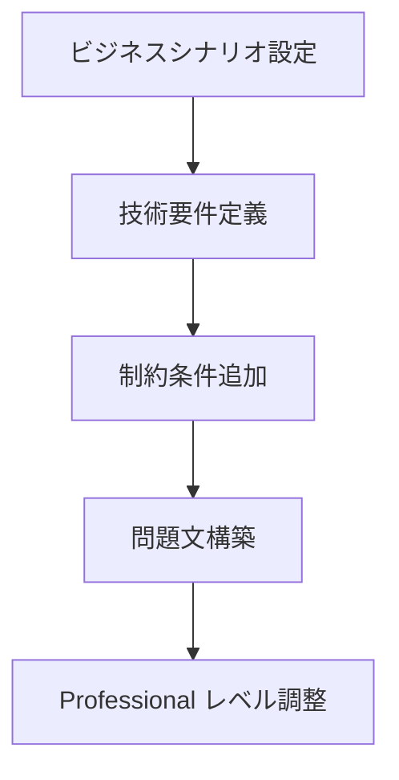
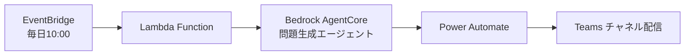
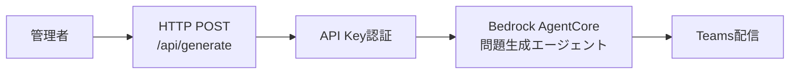

# Design Document

## Overview

AWS Exam Coach は、Power Automate と Microsoft Teams を活用した組織内コラボレーション学習プラットフォームです。AI エージェントが自動生成する AWS Certified Solutions Architect - Professional の試験問題を Teams チャネルに配信し、リアクションによる回答とスレッドでの議論を通じて、組織内のコミュニケーション活性化とスキルトランスファーを促進します。

### 設計原則

1. **シンプルさ優先**: 複雑な Teams App 開発を避け、Power Automate + HTTP リクエストで実装
2. **段階的リリース**: MVP から開始し、フィードバックに基づいて機能拡張
3. **既存環境活用**: Teams の標準機能（リアクション、スレッド）を最大限活用
4. **信頼性重視**: AWS 公式情報源のみを使用し、品質の高い問題を生成

## Architecture

### システム全体構成



### 主要コンポーネント

1. **AI 問題生成エンジン**

   - AWS 公式ドキュメント・試験ガイドからの情報取得
   - Professional レベル問題の自動生成
   - 品質検証・重複チェック

2. **Teams 連携システム**

   - Power Automate による問題配信
   - リアクション収集・分析
   - スレッド議論の促進

3. **データ管理システム**
   - 問題データベース
   - 参加状況・学習分析
   - 配信ログ・エラー管理

## AI 問題生成エンジン詳細設計

### 技術スタック

#### AI エージェント基盤

- **エージェントフレームワーク**: Strands Agents (オープンソース)
- **実行環境**: AWS Bedrock AgentCore Runtime (Preview)
- **アイデンティティ管理**: AWS Bedrock AgentCore Identity
- **メモリ管理**: AWS Bedrock AgentCore Memory
- **LLM**: Amazon Bedrock (Claude 4 Sonnet, Claude 3.7 Sonnet)

#### バックエンド

- **言語**: Python 3.11+
- **フレームワーク**: Strands Agents SDK + FastAPI
- **データベース**: PostgreSQL (問題・解析データ)
- **キャッシュ**: Redis (情報取得キャッシュ)

#### 外部連携・プロトコル

- **MCP (Model Context Protocol)**: 標準化されたコンテキスト提供
- **AWS Documentation MCP Server**: AWS 公式ドキュメント取得
- **AWS Knowledge MCP Server**: 試験関連情報取得
- **AWS Pricing MCP Server**: 設計段階でのコスト試算・技術選択支援
- **Power Automate**: Teams 配信用 HTTP API

#### インフラ・デプロイ

- **実行環境**: AWS Bedrock AgentCore Runtime (サーバーレス)
- **認証**: 簡単な API Key 認証 (MVP 用)
- **監視**: AgentCore 組み込み観測機能 + CloudWatch
- **トリガー**: EventBridge スケジュール + HTTP API + Teams コマンド

### システム構成 (Bedrock AgentCore + Strands Agents)



### 詳細シーケンス図



### コンポーネント詳細設計

#### 1. Strands Agents ベース問題生成エージェント

```python
from strands import Agent, Tool
from strands.providers.bedrock import BedrockProvider

# 情報取得ツール (MCP統合)
class AWSDocumentationTool(Tool):
    async def execute(self, service: str, topic: str) -> str:
        # MCP Server経由でAWS公式ドキュメント取得
        return await self.mcp_client.search_docs(service, topic)

class ExamGuideTool(Tool):
    async def execute(self, domain: str) -> str:
        # 試験ガイドから関連情報取得
        return await self.mcp_client.get_exam_info(domain)

# 問題生成エージェント
question_agent = Agent(
    name="AWS Question Generator",
    model=BedrockProvider(model="anthropic.claude-4-sonnet-20250522-v1:0"),
    tools=[AWSDocumentationTool(), ExamGuideTool()],
    prompt="""
    あなたはAWS Solutions Architect Professional レベルの
    試験問題生成専門エージェントです。

    以下の手順で高品質な問題を生成してください：
    1. 指定されたサービス/トピックの最新情報を取得
    2. 実際のビジネスシナリオベースの複合問題を作成
    3. Professional レベルに適した4つの選択肢を生成
    4. 詳細な解説を含める
    """,
    memory_config={
        "short_term": True,  # AgentCore Memory活用
        "long_term": True
    }
)
```

**取得対象:**

- **AWS 公式ドキュメント**: サービス別ユーザーガイド、API リファレンス、ベストプラクティス
- **試験ガイド**: 出題範囲、重要トピック、推奨知識レベル
- **キャッシュ戦略**: 24 時間キャッシュ、差分更新対応

#### 2. 問題生成サービス (QuestionGenerationService)

```python
class QuestionGenerationService:
    def __init__(self):
        self.llm_client = LLMClient()  # GPT-4 or Claude
        self.info_service = InfoRetrievalService()
        self.quality_service = QualityControlService()

    async def generate_question(self, request: GenerationRequest) -> Question:
        # 情報取得 → プロンプト構築 → LLM生成 → 品質検証

    def build_prompt(self, info: ServiceInfo, difficulty: str) -> str:
        # Professional レベル用プロンプト構築

    async def generate_with_retry(self, prompt: str, max_retries: int = 3) -> Question:
        # 品質基準を満たすまで再生成
```

**生成プロンプト構造:**

```
システム: AWS Solutions Architect Professional レベルの問題生成専門AI
コンテキスト: {取得した技術情報}
要求: 実際のビジネスシナリオベースの複合問題
制約: 4択、1つの正解、Professional レベル難易度
出力形式: JSON (問題文、選択肢、解説)
```

#### 3. 品質管理サービス (QualityControlService)

```python
class QualityControlService:
    def __init__(self):
        self.similarity_engine = SimilarityEngine()
        self.validation_rules = ValidationRules()

    async def validate_question(self, question: Question) -> ValidationResult:
        # 技術的正確性、難易度、明確性の検証

    async def check_similarity(self, question: Question) -> float:
        # 既存問題との類似度計算（70%閾値）

    def validate_professional_level(self, question: Question) -> bool:
        # Professional レベル要件チェック
```

**品質基準:**

1. **技術的正確性**: AWS 公式情報との整合性 > 95%
2. **難易度適正性**: Professional レベル指標スコア > 80
3. **問題明確性**: 曖昧性検出スコア < 20%
4. **類似度**: 既存問題との類似度 < 70%

### 問題生成アルゴリズム

#### 1. 問題文生成



**生成パターン:**

- **シナリオベース**: 実際の企業環境を想定した複合的な問題
- **ベストプラクティス**: AWS Well-Architected Framework に基づく設計問題
- **トラブルシューティング**: 障害対応・パフォーマンス改善問題

#### 2. 選択肢生成

- **正解**: 最適解または推奨されるベストプラクティス
- **不正解**: 説得力があるが不適切な選択肢を 3 つ生成
- **難易度調整**: Professional レベルに適した知識深度

#### 3. 解説生成

- **正解理由**: 詳細な技術的根拠と AWS 公式情報への参照
- **不正解理由**: 各選択肢の問題点と改善案
- **関連情報**: 関連する AWS サービス、ベストプラクティス

### 品質管理システム

#### 自動品質検証

1. **技術的正確性**: AWS 公式ドキュメントとの整合性確認
2. **難易度適正性**: Professional レベル要件との適合性
3. **問題明確性**: 曖昧さのない明確な問題文
4. **選択肢妥当性**: 適切な難易度の選択肢構成

#### 重複チェック

- **類似度計算**: 既存問題との文章類似度分析
- **トピック重複**: 同一サービス・機能の出題頻度管理
- **閾値設定**: 類似度 70%以上で重複判定

## 問題生成トリガー設計

### トリガー方法一覧

#### 1. スケジュール自動実行 (推奨・MVP)



**実装:**

```python
# EventBridge Rule
{
    "ScheduleExpression": "cron(0 10 * * ? *)",  # 毎日10:00 JST
    "Target": "QuestionGeneratorLambda"
}

# Lambda Function (トリガー用)
import boto3

def lambda_handler(event, context):
    # Bedrock AgentCore Runtime 呼び出し
    response = bedrock_agent_runtime.invoke_agent(
        agentId="question-generator-agent",
        sessionId=f"daily-{datetime.now().strftime('%Y%m%d')}",
        inputText="今日の問題を生成してください"
    )
    return {"statusCode": 200}
```

#### 2. HTTP API エンドポイント (手動実行用)



**実装:**

```python
# FastAPI エンドポイント
@app.post("/api/generate")
async def generate_question(
    request: GenerateRequest,
    api_key: str = Header(...)
):
    if api_key != settings.API_KEY:
        raise HTTPException(401, "Invalid API key")

    # エージェント呼び出し
    result = await invoke_question_agent(
        topic=request.topic,
        service=request.service
    )
    return {"job_id": result.session_id}

# 使用例
curl -X POST "https://api.example.com/api/generate" \
  -H "api-key: your-secret-key" \
  -H "Content-Type: application/json" \
  -d '{"topic": "VPC", "service": "EC2"}'
```

#### 3. Teams コマンド (ユーザーフレンドリー)

```mermaid
graph LR
    A[Teams メンバー] --> B[@AWS-Coach 問題生成]
    B --> C[Power Automate<br/>キーワード検知]
    C --> D[権限チェック]
    D --> E[HTTP API呼び出し]
    E --> F[問題生成・配信]
```

**実装:**

```json
// Power Automate フロー
{
  "trigger": {
    "type": "teams_message_posted",
    "condition": "contains(@AWS-Coach 問題生成)"
  },
  "actions": [
    {
      "type": "condition",
      "expression": "triggerBody().from.userPrincipalName in ['admin1@company.com', 'admin2@company.com']"
    },
    {
      "type": "http_request",
      "method": "POST",
      "uri": "https://api.example.com/api/generate",
      "headers": { "api-key": "@{parameters('API_KEY')}" }
    }
  ]
}
```

### 推奨実装順序 (Power Automate 中心アプローチ)

1. **Phase 1 (MVP)**: HTTP API + 手動確認

   - curl での基本動作確認・テスト
   - 問題生成 →Teams 配信の基本フロー確立
   - 簡単な API Key 認証

2. **Phase 2**: Power Automate スケジュール実行

   - Power Automate の「スケジュール」トリガー使用
   - HTTP API を定期呼び出し (毎日 10:00)
   - 完全自動化された問題配信
   - EventBridge/Lambda 不要でシンプル

3. **Phase 3**: インタラクティブ実行
   - Teams コマンドでの手動実行
   - より柔軟な問題生成オプション
   - 特定メンバーのみ実行権限

### セキュリティ考慮事項

- **API Key**: 環境変数で管理、定期ローテーション
- **権限制御**: Teams コマンドは管理者のみ
- **レート制限**: 1 日 1 回の問題生成制限
- **ログ監視**: 全実行を CloudWatch でログ記録

## 次のセクション予定

- Teams 連携システム詳細
- Data Models
- Error Handling
- Testing Strategy
